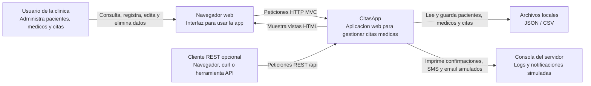
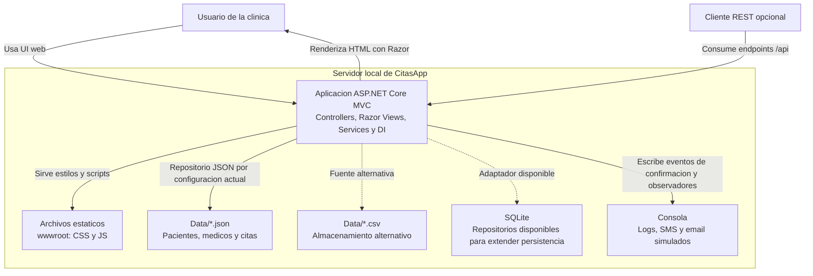
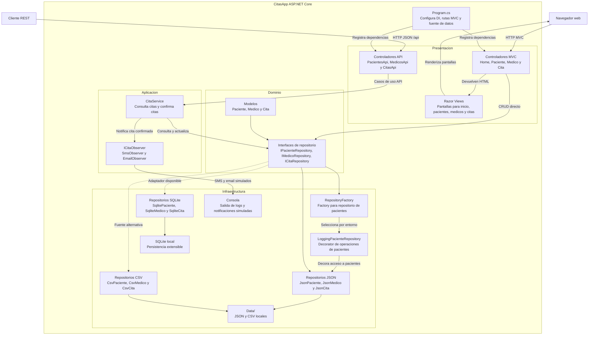
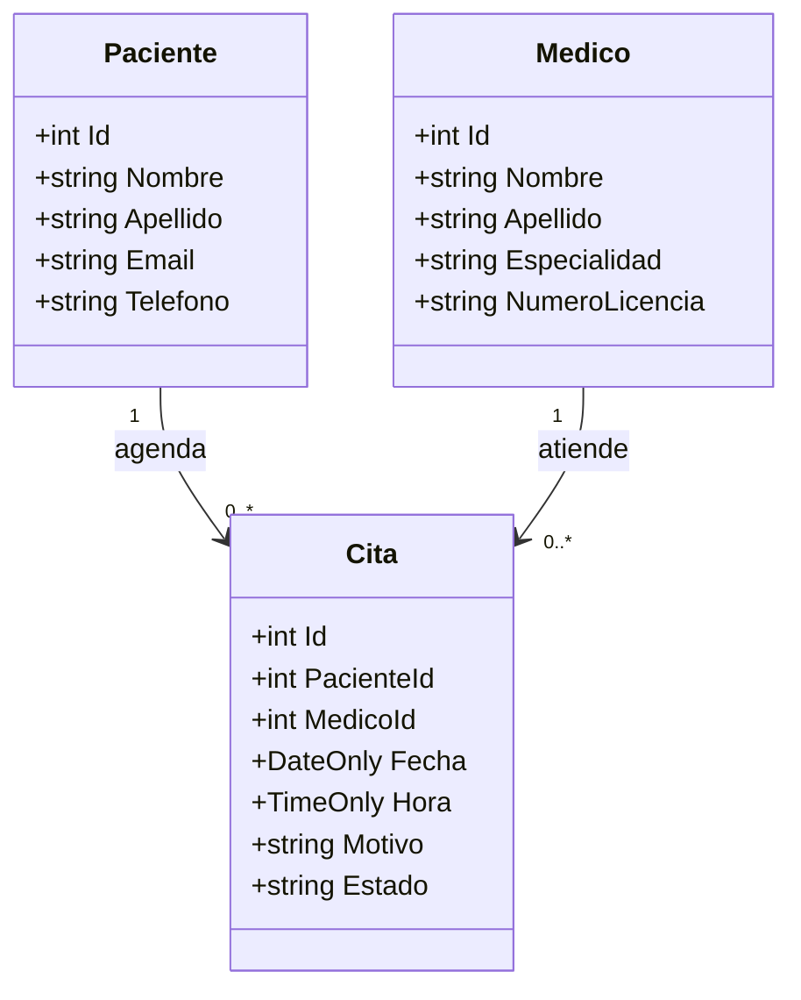

# Diagramas de CitasApp

Este archivo concentra los diagramas de arquitectura de CitasApp como codigo Mermaid. La rama de entrega para estos diagramas es `UML`.

## C4 Nivel 1 - Contexto

**Para quien es:** usuarios, revisores academicos y personas que necesitan entender el sistema sin entrar al codigo.

**Pregunta que responde:** quien usa CitasApp, que problema resuelve y con que elementos externos se relaciona.

CitasApp es una aplicacion web ASP.NET Core MVC para administrar pacientes, medicos y citas medicas. En el alcance academico no depende de una base de datos externa: puede trabajar con archivos locales JSON o CSV y tiene repositorios SQLite disponibles como alternativa de persistencia.

## C4 Nivel 2 - Contenedores

**Para quien es:** desarrolladores o evaluadores que necesitan ubicar las piezas tecnicas grandes.

**Pregunta que responde:** cuales son los contenedores principales del sistema y como se comunican.

El contenedor principal es una sola aplicacion ASP.NET Core MVC. Dentro de ella conviven la interfaz Razor, los controladores MVC, los endpoints REST y la capa de servicios. La persistencia queda aislada por repositorios intercambiables.

## C4 Nivel 3 - Componentes

**Para quien es:** desarrolladores que daran mantenimiento al codigo o necesitan explicar la arquitectura interna.

**Pregunta que responde:** que componentes internos procesan las acciones del usuario, la API, la persistencia y la confirmacion de citas.

Este nivel muestra la separacion principal de responsabilidades: la presentacion atiende pantallas y endpoints, `CitaService` concentra la confirmacion de citas y las consultas usadas por API, los modelos representan los datos centrales, y los repositorios aislan la persistencia local. Los patrones implementados aparecen asi: **Factory** en `RepositoryFactory`, **Decorator** en `LoggingPacienteRepository` y **Observer** en `SmsObserver` y `EmailObserver`.

## Diagrama de clases UML

**Para quien es:** revisores que quieren ver la relacion entre las clases de dominio principales.

**Pregunta que responde:** que datos componen pacientes, medicos y citas, y como se relacionan.

## Declaracion de uso de IA

Se utilizo inteligencia artificial como apoyo para organizar los diagramas, redactar notas de interpretacion y verificar que el contenido correspondiera con la estructura real del proyecto. La seleccion final, revision, commit y publicacion corresponden al autor del repositorio.
