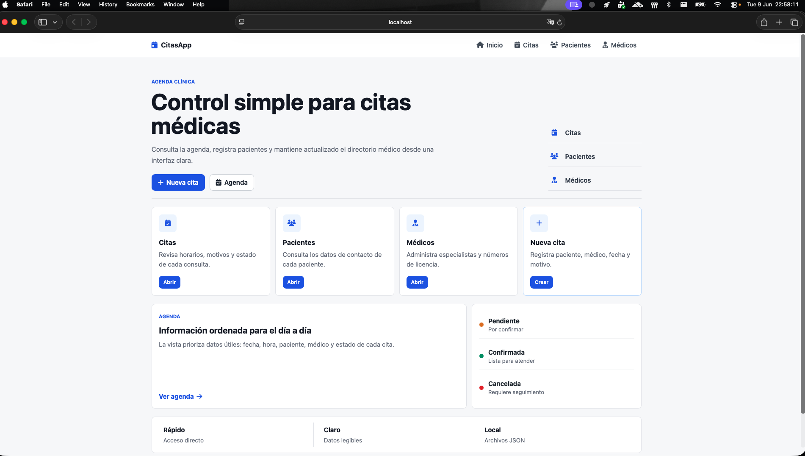
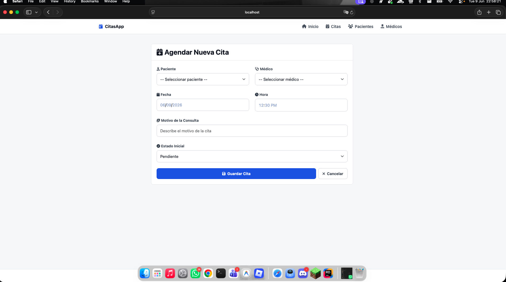

# CitasApp

CitasApp es una app web sencilla para llevar el control de citas medicas. La idea es tener en un solo lugar los pacientes, los medicos y las citas, sin tener que configurar una base de datos ni montar algo demasiado pesado.

Esta hecha con ASP.NET Core MVC y puede guardar la informacion en archivos JSON o CSV, asi que funciona bien para practicar arquitectura, vistas, controladores, repositorios e interfaces.

## Objetivo

El objetivo del proyecto es aplicar conceptos de arquitectura de software en una aplicacion real pero pequena. La app sirve para entender como se separan responsabilidades entre controladores, modelos, vistas, interfaces y repositorios.

Tambien ayuda a ver algunos trade-offs: por ejemplo, usar archivos locales hace que el proyecto sea mas facil de correr, aunque no sea la opcion mas completa para una app grande.

## Que se puede hacer

- Ver una pantalla principal con accesos rapidos.
- Registrar pacientes.
- Registrar medicos.
- Crear citas relacionando paciente, medico, fecha, hora, motivo y estado.
- Editar informacion existente.
- Eliminar registros cuando ya no se necesiten.
- Consultar citas por paciente.

## Tecnologias usadas

- ASP.NET Core MVC
- C#
- Razor Views
- Bootstrap
- CSS personalizado
- Archivos JSON como almacenamiento local
- Archivos CSV como almacenamiento alternativo
- SQLite como adapter disponible para extender el almacenamiento

## Estructura del proyecto

```text
CitasApp/
├── Controllers/
│   ├── CitaController.cs
│   ├── HomeController.cs
│   ├── MedicoController.cs
│   └── PacienteController.cs
├── Models/
│   ├── Cita.cs
│   ├── Medico.cs
│   └── Paciente.cs
├── Views/
│   ├── Cita/
│   ├── Home/
│   ├── Medico/
│   ├── Paciente/
│   └── Shared/
├── Interfaces/
├── Repositories/
├── Data/
│   ├── Citas.json
│   ├── Medicos.json
│   ├── Pacientes.json
│   ├── citas.csv
│   ├── medicos.csv
│   └── pacientes.csv
├── Samples/
│   └── Program_CitasApp.cs
└── wwwroot/
    ├── css/
    └── js/
```

## Requisitos

Para correr el proyecto necesitas tener instalado:

- .NET SDK 10 o superior

## Como ejecutar

Desde la carpeta del proyecto:

```bash
dotnet restore
dotnet run
```

Despues abre en el navegador la URL que indique la consola. En este proyecto normalmente se usa:

```text
http://localhost:5066
```

Tambien puedes abrir la solucion en Rider usando `CitasApp.sln`.

## Modulos principales

### Inicio

Muestra una vista general y accesos directos a las partes principales del sistema.

### Citas

Permite listar, crear, editar y eliminar citas. Cada cita incluye paciente, medico, fecha, hora, motivo y estado.

### Pacientes

Permite listar, crear, editar y eliminar pacientes. Cada paciente guarda datos basicos como nombre, apellido, correo y telefono.

### Medicos

Permite listar, crear, editar y eliminar medicos. Cada medico tiene nombre, apellido, especialidad y numero de licencia.

## Almacenamiento de datos

La app puede trabajar con dos fuentes de datos locales dentro de la carpeta `Data`:

- JSON: datos originales del proyecto.
- CSV: datos importados desde los archivos agregados posteriormente.

La seleccion de la fuente se hace en `Program.cs`, en la variable `fuenteDatos`.

Para usar JSON:

```csharp
var fuenteDatos = "json";
// var fuenteDatos = "csv";
```

Para usar CSV:

```csharp
// var fuenteDatos = "json";
var fuenteDatos = "csv";
```

Despues de cambiar la fuente, hay que detener la app y volverla a ejecutar. Refrescar el navegador no reinicia los servicios ni vuelve a cargar la configuracion.

Los repositorios disponibles estan en `Repositories/`:

- `JsonPacienteRepository`, `JsonMedicoRepository`, `JsonCitaRepository`
- `CsvPacienteRepository`, `CsvMedicoRepository`, `CsvCitaRepository`
- `SqlitePacienteRepository`, `SqliteMedicoRepository`, `SqliteCitaRepository`

El archivo `Samples/Program_CitasApp.cs` queda solo como referencia de configuracion. No es el archivo que controla la app en ejecucion.

## Capturas

### Pantalla de inicio



Esta es la vista principal de la aplicacion. Desde aqui se puede entrar rapido a citas, pacientes y medicos. Tambien aparece un acceso directo para crear una nueva cita sin tener que navegar tanto.

El diseño se dejo mas minimalista: colores simples, tarjetas limpias y una estructura pensada para que se entienda rapido que hace cada modulo.

### Agendar nueva cita



Esta pantalla sirve para registrar una cita nueva. El formulario permite seleccionar paciente y medico, poner fecha, hora, motivo de consulta y estado inicial.

La idea es que el formulario sea directo y facil de usar, sin demasiados elementos visuales que distraigan. Solo muestra los campos necesarios para crear la cita.

## Notas de mantenimiento

Se agregaron adapters para CSV y SQLite sin eliminar los repositorios JSON existentes. Tambien se documentaron las fuentes de datos para que sea claro cuando se esta usando la informacion original y cuando se esta usando la informacion importada.
