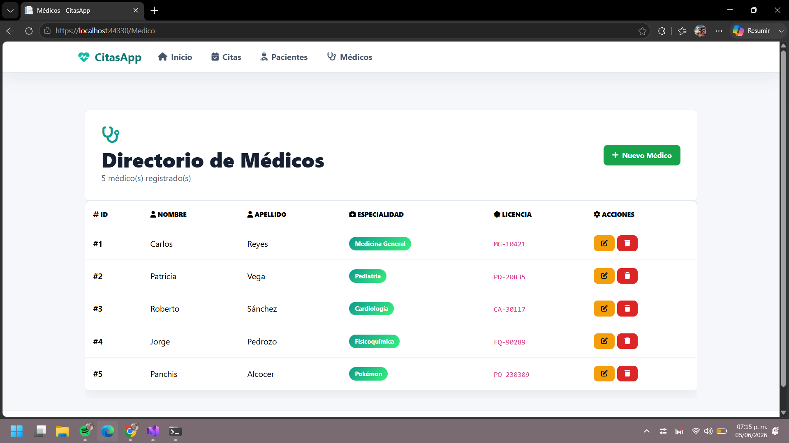

# CitasApp

Es una aplicación web desarrollada con ASP.Net Core MVC para gestionar citas médicas de forma sencilla. Permite administrar
pacientes, médicos y citas desde una interfaz clara y organizada. 

## Objetivo

El objetivo de esta actividad es comprender las vistas arquitectónicas y los trade-offs mediante la creación de la aplicación.

## Tecnologías Usadas
 - ASP.Net Core MVC
 - CSS Personalizado
 - Archivos JSON como almacenamiento de datos
 - Razor para las vistas
 - Bootstrap para el diseño responsivo
 
## Estructura del proyecto
  ```text
  CitasApp/
  ├── Controllers/
  │   ├── CitaController.cs
  │   ├── HomeController.cs
  │   ├── MedicoController.cs
  │   └── PacienteController.cs
  ├── Models/
  │   ├── Cita.cs
  │   ├── Medico.cs
  │   └── Paciente.cs
  ├── Views/
  │   ├── Cita/
  │   ├── Home/
  │   ├── Medico/
  │   ├── Paciente/
  │   └── Shared/
  ├── Repositories/
  ├── ímages/
  ├── Interfaces/
  ├── Data/
  │   ├── citas.json
  │   ├── Medicos.json
  │   └── Pacientes.json
  └── wwwroot/
      └── css/
          └── site.css
 ```

 ## Requisitos

 Antes de ejecutar el proyectio, se debe instalar: 

 - .NET SDK 10 o superior.
 
 ## Cómo ejecutar

 1. Clona o abre el proyecto.
 2. Entra a la carpeta del proyecto
     ```sh
     cd CitasApp
     ```
 3. Restaura las dependencias:
     ```sh
     dotner restore
     ```
 4. Ejecuta la aplicación.
     ```sh
     dotnet run 
     ```
 5. Abre el navegador en la URL que indique.
 
 ## Resultado

 
 

 

 ## Módulos principales

 Muestra un panel principal con accesos rápidos para consultar citas, pacientes, médicos y crear una nueva cita.

 ### Citas
  Permite listar, crear, editar y eliminar citas. Al crear o editar una cita, se selecciona el paciente, el médico y la fecha.

  ### Pacientes
  Permite listar, crear, editar y eliminar pacientes. Cada paciente tiene un nombre, edad y número de contacto.

  ### Médicos
  Permite listar, crear, editar y eliminar médicos. Cada médico tiene un nombre, especialidad y número de licencia.

  ## Almacenamiento de datos
  Actualmente, la aplicación utiliza archivos JSON dentro de la carpeta Data para almacenar la información de citas, pacientes y médicos. Esto facilita la gestión de datos sin necesidad de configurar una base de datos.

  ## Cláusula de IA
 Este proyecto fue desarrollado utilizando herramientas como los proyectos pasados realizados, el uso de Inteligencia Artificial para hacer el linkeo de los Datos y la Interfaz permitiendo obtener una aplicación fluida y funcional.
